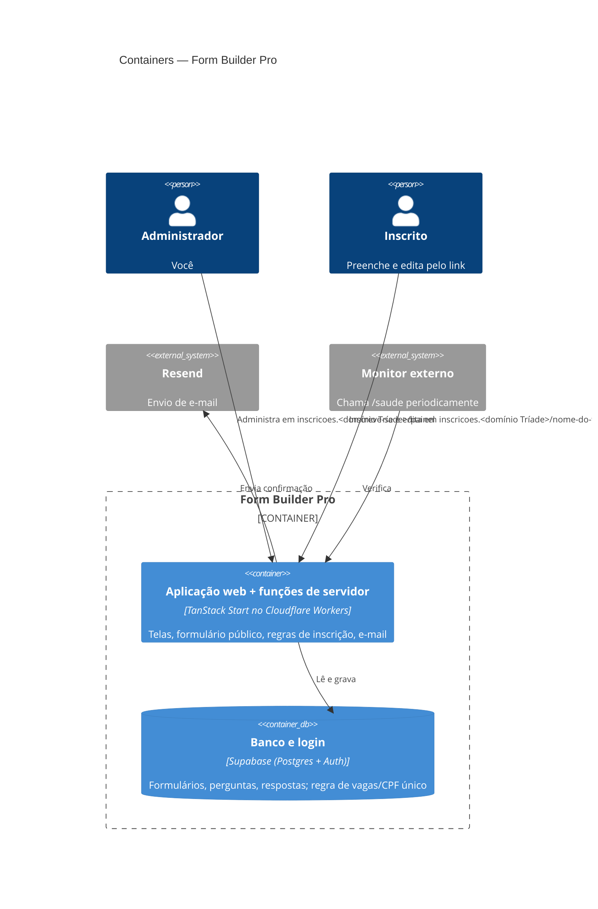

# PRD — Form Builder Pro (v2.1 · foco: ir ao ar hoje)

> **Base:** prompt original do Lovable + leitura do código do repositório + respostas do Thiago.
> **Limites de planos** verificados em 29/09/2026 (podem mudar; conferir antes de escalar).
> **Verificado no repositório (29/09/2026):** o `build` passa e gera o Worker para a Cloudflare (0,86 MB compactado); o `tsc` **falha** (13 erros em `f.$slug.tsx`); não existem testes. A mensagem de sucesso personalizada hoje não aparece (bug). Detalhes em `specs/001-fase-0-no-ar/plan.md`; comportamento e tarefas em `specs/001-fase-0-no-ar/`.

---

## 1. Problema e objetivo

Organizar inscrições (corridas, eventos) com **CPF validado**, **vagas limitadas**, **prazo com data e hora**, visual próprio e exportação para **Excel/PDF**. O Google Forms não valida CPF nem trava vagas.

**Objetivo desta versão:** colocar no ar, em um subdomínio da Tríade, um sistema de **uso próprio** (não é SaaS) que crie formulários de 40 a 60 inscrições, com **inscrição única por CPF** e **link de edição enviado ao inscrito**.

**Sucesso =** você publica um formulário real, 50 pessoas se inscrevem sem duplicidade, ninguém passa do limite e cada inscrito consegue corrigir os próprios dados (ex.: trocar 5 km por 10 km) sem falar com você.

## 2. Quem usa

- **Organizador (só você):** cria formulários, compartilha o link, acompanha e exporta.
- **Inscrito (público):** preenche pelo celular, recebe e-mail de confirmação e pode editar pelo link.

## 3. Escopo

### Já existe no código (só validar em teste)
Criar formulário e perguntas · 10 tipos de campo (texto, número, e-mail, telefone, CPF, RG, data, escolha única/múltipla) · validação de CPF (dígitos), RG (formato), telefone e e-mail, no navegador **e** no servidor · cor, fonte e logotipo (por URL) · publicar/encerrar e link público (hoje `/f/slug`, com final gerado automaticamente; passa a ser personalizável no RF-11) · limite de vagas e prazo com data/hora · formulário público responsivo · tabela de respostas · exportar Excel e PDF · painel de formulários.

### Vai ser construído agora (Fase 0)

**RF-01 — Acesso único do administrador** · Must
Só você entra. Sem tela de cadastro e sem login com Google (o Google atual depende do Lovable Cloud e não funcionará fora dele).
*Aceite:* Dado um visitante em `/auth`, então só existe e-mail + senha; tentar criar conta por qualquer meio é recusado pelo banco.

**RF-02 — Página inicial** · Must
*Aceite:* Dado `/`, então redireciona para `/painel` (logado) ou `/auth`.

**RF-03 — Inscrição única por CPF** · Must
Se o formulário tem um campo CPF, o mesmo CPF (com ou sem pontos/traço) só pode se inscrever uma vez naquele formulário.
*Aceite:* Dado o CPF `529.982.247-25` já inscrito, quando alguém envia `52998224725`, então recebe "CPF já inscrito. Use o link de edição enviado ao seu e-mail" e nada é gravado.

**RF-04 — Limite de vagas seguro** · Must
*Aceite:* Dado limite 5 e 20 envios simultâneos, então exatamente 5 são gravados.

**RF-05 — E-mail de confirmação com link de edição** · Must
Ao concluir, se o formulário tem um campo e-mail, o inscrito recebe o resumo das respostas (CPF e RG parcialmente ocultos, ex.: `***.***.***-25`) e o link `/editar/{token}` (**independe do endereço do formulário**, então trocar o endereço não quebra links já enviados). **Se o e-mail falhar, a inscrição vale do mesmo jeito** e a tela final mostra o mesmo link com o aviso "guarde este link".
*Aceite:* Dado envio válido, então a resposta é gravada, o e-mail é disparado e a tela de sucesso mostra o link; se o serviço de e-mail estiver fora do ar, a inscrição continua gravada.

**RF-06 — Editar inscrição pelo link** · Must
*Aceite:* Dado o link do inscrito e o formulário aberto, quando ele muda "5 km" para "10 km" e salva, então a tabela do admin mostra 10 km, a vaga **não** é consumida de novo, o CPF aparece **bloqueado** (não editável) e um novo e-mail com o resumo é enviado. Dado formulário encerrado ou prazo vencido, então o link mostra "edição encerrada".

**RF-07 — Copiar link de edição no admin** · Must
Para quando o inscrito perde o e-mail.
*Aceite:* Dado uma linha da tabela de respostas, quando clico em "Copiar link de edição", então o link é copiado.

**RF-08 — Consentimento (LGPD)** · Must
Campo opcional por formulário com o texto de consentimento; se preenchido, o aceite é obrigatório.
*Aceite:* Dado consentimento configurado, quando o inscrito não marca, então o envio é bloqueado (no navegador e no servidor).

**RF-09 — Antispam mínimo** · Should
Campo escondido (honeypot) que humanos não preenchem; envios com ele preenchido são descartados.

**RF-10 — Endurecimento (interno)** · Must
Remover leitura pública direta das tabelas (o formulário público já passa pelo servidor) e carregar Excel/PDF só quando o botão for clicado (deixa o sistema mais leve; o limite de 3 MB do Worker não é problema hoje).
*Aceite:* Dado a chave pública do banco, então não consigo listar formulários nem perguntas; o pacote compactado do Worker continua abaixo de 3 MB (medido hoje: 0,86 MB).

**RF-11 — URL personalizada do formulário** · Should (pequeno, entra na Fase 0)
Como organizador, quero definir o final do endereço de cada formulário, direto depois da barra: `inscricoes.<domínio da Tríade>/skf-corrida-track-field` (sem `/f/`).
*Regras:* 3 a 60 caracteres · só letras minúsculas, números e hífen (o campo converte ao digitar: acento some, espaço vira hífen) · não começa nem termina com hífen · **único** no sistema · **não pode ser nome reservado** do sistema (`auth`, `painel`, `formularios`, `api`, `saude`, `admin`, `assets`, `login`, `editar`). Se ficar vazio, é gerado a partir do título.
*Aceite:* Dado "SKF Corrida Track&Field" digitado, então vira `skf-corrida-track-field`. Dado um endereço já usado por outro formulário, então aparece "endereço já em uso" (avisado ao digitar **e** garantido pelo banco ao salvar). Dado `painel`, então é recusado. Dado um formulário já publicado, quando troco o endereço, então aparece o aviso "o link antigo vai parar de funcionar" e o link antigo passa a mostrar "formulário não encontrado".
*Impacto técnico:* a rota pública passa de `/f/{slug}` para `/{slug}` (as rotas fixas como `/painel` têm prioridade sobre a dinâmica) e o link de edição é `/editar/{token}`, **sem o slug**, justamente para que renomear o endereço não invalide links já enviados por e-mail.

**RF-12 — Mensagem de sucesso personalizada** · Must (correção de bug)
Hoje a mensagem que o administrador escreve **nunca aparece** (a tela lê um campo que o servidor não envia).
*Aceite:* Dado a mensagem "Inscrição confirmada! Nos vemos na largada.", quando uma inscrição é concluída, então essa mensagem aparece.

### Depois (Fase 1) — não bloqueia o lançamento
Data/hora de **abertura** · excluir resposta pela tela · upload de logotipo · duplicar formulário · busca na tabela · Cloudflare Turnstile (captcha) · reenvio do link pelo próprio inscrito · pré-visualização no editor.

### Fora do escopo
Quiz com nota · multiusuário/SaaS · validar que o CPF **existe** (serviço pago; só validamos os dígitos) · validação de existência de RG (não há regra nacional) · lógica condicional · upload de arquivo pelo inscrito.

## 4. Requisitos não funcionais

| Área | Critério |
|---|---|
| **Segurança** | Dados só acessíveis pelo administrador (regras de acesso por linha, já existem). Chave de serviço **só** como Segredo do Worker, nunca no repositório. Token de edição aleatório de 32 bytes, guardado no banco (aceitável para este porte). |
| **LGPD** | Consentimento (RF-08), CPF mascarado em e-mail (RF-05), acesso restrito. Definir por quanto tempo guardar os dados após cada evento. |
| **Integridade** | Toda regra (CPF único, limite, prazo) valida **no servidor/banco**, nunca só na tela. |
| **Fuso** | Prazos em `America/Sao_Paulo`. |
| **Disponibilidade** | Sem SLA; monitor externo gratuito chamando uma rota de saúde a cada poucos minutos (também evita a pausa do banco, ver 6). |
| **Backup** | O plano gratuito do banco **não tem backup**: exportar o Excel ao encerrar cada formulário. |

## 5. Arquitetura

**Padrão: monolito full-stack serverless.** Uma única aplicação (telas + funções de servidor) rodando no Cloudflare Workers, com banco e login gerenciados. Justificativa: uso próprio, 40–60 inscrições por formulário, nenhuma parte com perfil de carga diferente. Nada a separar.

**Fluxo de inscrição (o coração do sistema):** o navegador envia respostas → função de servidor valida tudo → **uma única operação no banco** confere status, prazo, limite e CPF duplicado e grava (ou recusa) → gera token → dispara e-mail → devolve a tela de sucesso com o link.

**Checagem dos 6 pilares:** *operação* — erros já são capturados, monitor cobre queda · *segurança* — ver seção 4 · *confiabilidade* — ponto único (banco gratuito, sem backup): mitigado por exportação manual · *performance* — folgada (100 mil requisições/dia no Workers gratuito contra dezenas de inscrições) · *custo* — R$ 0 no início · *sustentabilidade* — sem desperdício.

## 6. Stack e decisões

**Mantém:** React 19 + TypeScript, TanStack Start, Tailwind + shadcn/ui, Supabase. Matriz ponderada (peso × nota, 7 fatores): manter a stack atual **63** · migrar para Next.js **54** · reescrever em Laravel **45**. O código já existe e é tipado; migrar não traz ganho.

| Decisão | Escolha | Por quê | Alternativa descartada |
|---|---|---|---|
| Hospedagem | **Cloudflare Workers (plano gratuito)**, subdomínio da Tríade como Domínio Personalizado | Pedido do Thiago; o projeto já compila para Cloudflare por padrão (Nitro) | Hospedagem do Lovable (prende ao Lovable) |
| Banco/Auth | **Projeto Supabase novo e próprio**, aplicando as 2 migrações do repositório | O banco atual é do Lovable Cloud e a chave de serviço (necessária ao servidor) pode não estar acessível; projeto próprio dá controle total | Cloudflare D1: obrigaria reescrever acesso a dados, segurança e regras (não cabe em "horas") |
| E-mail | **Resend** (plano gratuito), remetente em subdomínio da Tríade | API simples; verificação de domínio por DNS na própria Cloudflare | Enviar e-mail pelo Supabase Auth (feito só para login) |
| Login | E-mail + senha, cadastro público **desligado** no Supabase; usuário admin criado à mão | Uso próprio | Google (depende do Lovable Cloud) |
| Regra de vaga/CPF | **Função no banco** (transação única) | Único jeito honesto de garantir limite com envios simultâneos | Contar e gravar no código (como está hoje) |
| Custo | Tudo gratuito; subir de plano só com uso validado | Preferência do projeto | — |

**Limites do plano gratuito que importam** (verificados hoje):
- **Cloudflare Workers:** 100 mil requisições/dia, **10 ms de CPU por requisição**, Worker de até **3 MB**.
- **Supabase:** 500 MB de banco, **pausa após 7 dias sem uso**, **sem backup**, máximo de 2 projetos ativos por conta.
- **Resend:** 3.000 e-mails/mês, **100/dia**.

## 7. Modelo de dados (mudanças sobre o que já existe)

Já existe: **Formulário** (título, descrição, status, tema, limite de vagas, prazo, mensagem de sucesso, slug) → **Pergunta** (rótulo, tipo, obrigatória, opções, ordem) · **Resposta** (respostas por pergunta, enviado em).

| Entidade | Adicionar | Regra |
|---|---|---|
| Formulário | texto de consentimento (opcional) | Se preenchido, aceite obrigatório |
| Formulário | **regra do endereço (slug)**: o campo já existe e já é único; falta impor no banco o formato (minúsculas, números, hífen, 3–60) e a lista de nomes reservados | Ver RF-11 |
| Resposta | **identificador** (CPF só com dígitos), **token de edição** (único), **data do consentimento**, **atualizado em** | Único por (formulário + identificador). Identificador = a pergunta do tipo CPF, se houver. E-mail de confirmação = a pergunta do tipo e-mail, se houver. **Sem configuração extra.** |

Cuidado conhecido: as respostas apontam para o ID da pergunta; **não exclua perguntas de um formulário que já tem inscritos** (os dados sumiriam da tabela).

## 8. Riscos e o que fazer

| # | Risco | Ação |
|---|---|---|
| R-01 | **10 ms de CPU** por requisição no Workers gratuito pode ser pouco para renderizar a página no servidor (erro 1102) | Testar no primeiro deploy. Se falhar: plano pago do Workers (a partir de US$ 5/mês), a única despesa provável |
| R-02 | ~~Pacote > 3 MB por causa das bibliotecas de Excel/PDF~~ **Descartado por medição:** o Worker compilado tem 0,86 MB compactado (limite gratuito: 3 MB) | Manter o pacote sob controle; carregar Excel/PDF só ao clicar (RF-10) reduz peso |
| R-03 | **Banco pausa** após 7 dias parado (evento vira "site fora do ar") | Monitor externo chamando `/saude` que consulta o banco |
| R-04 | Sem backup no plano gratuito | Exportar Excel ao encerrar cada formulário |
| R-05 | Conta pode já ter 2 projetos Supabase gratuitos ativos | Conferir; se sim, pausar/remover um ou pagar 1 plano |
| R-06 | Limite de 100 e-mails/dia se dois eventos abrirem no mesmo dia | E-mail nunca bloqueia a inscrição; o link aparece na tela; RF-07 cobre |
| R-07 | O link de edição funciona como "senha" da inscrição | Token longo e aleatório, nunca exibir CPF completo em e-mail |
| R-08 | Variáveis de ambiente somem/erram no Cloudflare | Chave de serviço e chave do Resend como **Segredo** do Worker (não como variável de build); as chaves **públicas** do Supabase podem ficar no `.env` do repositório |
| R-09 | ~~Estado real do app desconhecido~~ **Verificado:** compila, mas `tsc` falha e não há testes | Task T-01 corrige e cria a base de testes |
| R-10 | Trocar o endereço de um formulário **já divulgado** quebra o link que as pessoas têm | Aviso na tela (RF-11); depois de divulgar, evite mudar |
| R-11 | Um formulário com nome igual a uma rota do sistema (ex.: `painel`) esconderia a tela do sistema | Lista de nomes reservados validada no servidor e no banco (RF-11) |

## 9. Plano de execução (ordem importa: risco primeiro)

1. **Rodar o app local + criar projeto Supabase próprio** com as 2 migrações; criar o usuário admin; desligar cadastro público.
2. **Deploy "esqueleto" no Workers + subdomínio** (mesmo antes das mudanças): valida R-01 e as variáveis de ambiente (R-02 já foi medido). É o passo mais arriscado, por isso vem cedo.
3. **Limpeza de acesso e rotas:** RF-01, RF-02, RF-10 e RF-11 (mover o formulário público de `/f/{slug}` para `/{slug}`).
4. **Regra de inscrição no banco:** RF-03 + RF-04 (função única) e ajuste da função de envio.
5. **Verificar domínio no Resend** (registros DNS na Cloudflare; pode levar alguns minutos) e implementar RF-05.
6. **Edição:** RF-06, RF-07, RF-08, RF-09.
7. **Teste ponta a ponta com um formulário real:** 5 envios simultâneos para 3 vagas, CPF repetido, edição de 5 km → 10 km, prazo vencido, exportar Excel e PDF, celular.
8. **Monitor externo** em `/saude` e publicação do primeiro formulário.

> Detalhamento executável (spec, plano técnico, modelo de dados testado e 14 tarefas com verificação): `specs/001-fase-0-no-ar/`.

## 10. Confirmar (se não responder, sigo com o padrão)

1. **Subdomínio** desejado? *(padrão: `inscricoes.<domínio da Tríade>`)*
2. **Remetente do e-mail:** qual endereço? *(padrão: `inscricoes@` em um subdomínio da Tríade dedicado ao envio)*
3. **Até quando o inscrito pode editar?** *(padrão: até o prazo/encerramento do formulário; vaga cheia não impede edição)*
