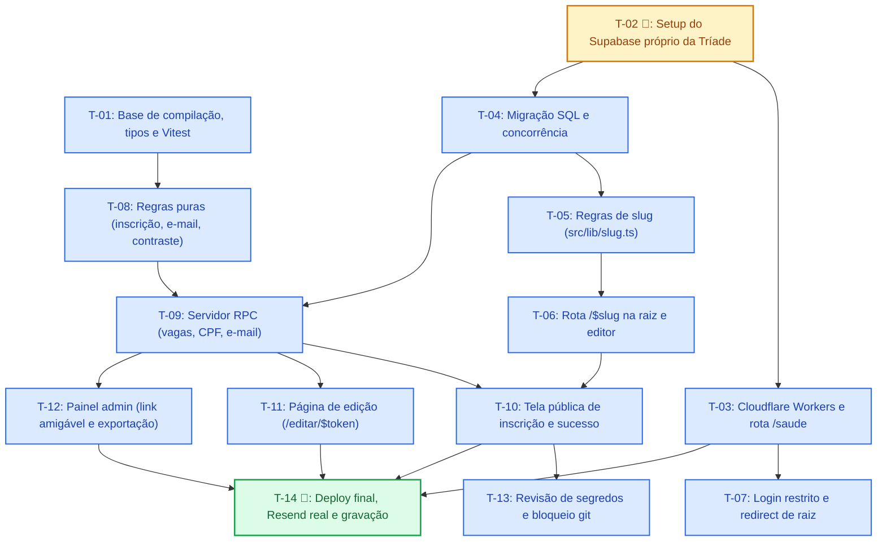

# Ordem de Execução das Tarefas — Spec 001 (Fase 0 no Ar)

> **Documento de referência:** [tasks.md](file:///c:/Users/conta/OneDrive/Documentos/Tríade%20Tecnologia%20e%20Soluções/Desenvolvimento%20de%20Sistemas/Criador%20de%20Formulários/form-builder-pro/specs/001-fase-0-no-ar/tasks.md)  
> **Regra de ouro do projeto:** Executar **uma task por vez**, rodar a verificação completa (`bunx tsc --noEmit`, testes Vitest e build) antes de iniciar a próxima.

---

## 1. Grafo Visual de Dependências



---

## 2. Ordem de Execução Recomendada (Sequência Linear)

Esta é a sequência recomendada para o desenvolvedor ou agente executar do início ao fim sem bloqueios:

| Passo | Task | Tipo | Título Resumido | Depende de | O que desbloqueia |
|:---:|:---:|:---:|:---|:---|:---|
| **1** | **T-01** | Automatizada | Base de compilação, tipos e Vitest | *Nenhuma* | T-08 |
| **2** | **T-02** | Manual 🧑 | Setup do Supabase próprio da Tríade | *Nenhuma* | T-03, T-04 |
| **3** | **T-04** | Automatizada | Migração do banco para a Fase 0 e teste de concorrência | T-02 | T-05, T-09 |
| **4** | **T-08** | Automatizada | Regras puras de inscrição, validação, e-mail e contraste | T-01 | T-09 |
| **5** | **T-05** | Automatizada | Regras de endereço amigável (`slug.ts`) | T-04 | T-06 |
| **6** | **T-09** | Automatizada | Servidor de inscrição: persistência, vagas, CPF único e e-mail | T-04, T-08 | T-10, T-11, T-12 |
| **7** | **T-06** | Automatizada | Endereço do formulário na raiz e edição no painel | T-05 | T-10 |
| **8** | **T-03** | Automatizada | Esqueleto Cloudflare Workers e rota `/saude` | T-02 | T-07, T-14 |
| **9** | **T-07** | Automatizada | Autenticação: só o admin entra e raiz protegida | T-03 | — |
| **10** | **T-10** | Automatizada | Tela pública de inscrição e confirmação | T-06, T-09 | T-13, T-14 |
| **11** | **T-11** | Automatizada | Página de edição da inscrição (`/editar/{token}`) | T-09 | T-14 |
| **12** | **T-12** | Automatizada | Painel admin: link amigável e exportação limpa | T-09 | T-14 |
| **13** | **T-13** | Automatizada | Revisão de segredos e bloqueio de commit | T-10 | — |
| **14** | **T-14** | Mista 🧑 | Produção no ar, e-mail real, monitoramento e teste ponta a ponta | T-10, T-11, T-12, T-03 | Conclusão da Fase 0 |

---

## 3. Detalhamento por Ondas de Implementação

### Onda 0 — Fundação e Setup Externo
Tarefas que preparam o ambiente local e a infraestrutura básica de nuvem. Não dependem de nenhuma outra tarefa.
- **[T-01] Base de compilação, tipos e Vitest**
  - *Objetivo:* Garantir que `bun run test`, `bun run build` e `bunx tsc --noEmit` rodem limpos, com TypeScript estrito e banco tipado em `src/integrations/supabase/types.ts`.
  - *Critério de saída:* Vitest rodando e passando 100%.
- **[T-02 🧑] Setup do Supabase próprio da Tríade**
  - *Objetivo:* Criar o projeto no Supabase da Tríade, aplicar variáveis no `.env` e `.dev.vars`, criar o usuário do administrador único e desligar cadastro público e OAuth externo.
  - *Critério de saída:* `curl` na URL do Supabase retornando resposta da API e `.dev.vars` configurado localmente.

---

### Onda 1 — Banco de Dados, Infraestrutura Básica e Lógica Pura
Tarefas que criam as fundações de dados, o backend serverless e a lógica de validação isolada de framework.
- **[T-04] Migração do banco para a Fase 0 e teste de concorrência** *(Depende de: T-02)*
  - *Objetivo:* Criar a migração SQL com todas as colunas de slug, consentimento, RPCs de concorrência `submit_response` e `update_response`.
  - *Critério de saída:* Script de verificação do banco passando (vagas esgotam no limite exato e CPF duplicado é rejeitado atomicamente).
- **[T-08] Regras puras de inscrição, validação, e-mail e contraste** *(Depende de: T-01)*
  - *Objetivo:* Testar com TDD puro as regras de negócio em memória: `validateAnswer`, `formatAnswerForDisplay`, sanitização HTML com `escapeHtml`, template de e-mail e `readableTextColor` (WCAG AA com contraste >= 4,5:1).
  - *Critério de saída:* Testes unitários cobrindo todos os tipos de campos e casos de contraste.
- **[T-03] Esqueleto Cloudflare Workers e rota `/saude`** *(Depende de: T-02)*
  - *Objetivo:* Configurar `wrangler.json`, rotas de API, checagem da conexão com Supabase e Resend através da rota GET `/saude`.
  - *Critério de saída:* `npx wrangler dev` respondendo HTTP 200 com status `ok` em `/saude`.

---

### Onda 2 — Camada de Negócio e Endereçamento
Tarefas que amarram as funções de banco às chamadas de servidor e preparam as rotas amigáveis.
- **[T-05] Regras de endereço amigável (`slug.ts`)** *(Depende de: T-04)*
  - *Objetivo:* Gerador e normalizador de slugs, validação de formato e conferência estrita com a lista de slugs reservados do banco.
  - *Critério de saída:* Teste comparativo garantindo que a lista reservada no TypeScript é 100% idêntica à da migração SQL.
- **[T-09] Servidor de inscrição: persistência, vagas, CPF único e disparo de e-mail** *(Depende de: T-04, T-08)*
  - *Objetivo:* Implementar `submitPublicFormServerFn` e `updatePublicResponseServerFn` conectando ao RPC do banco com chave de serviço e integrando envio de e-mail via Resend (com fallback seguro: se o e-mail falhar, a inscrição **não** é cancelada).
  - *Critério de saída:* Teste de integração do servidor simulando sucesso e falha de envio de e-mail.
- **[T-07] Autenticação: só o admin entra e raiz protegida** *(Depende de: T-03)*
  - *Objetivo:* Tela de login limpa sem links públicos de cadastro ou Google, e rota raiz `/` redirecionando para `/painel` se logado ou `/auth` se anônimo.
  - *Critério de saída:* Teste de rotas protegidas e inspeção visual da ausência de cadastro público.

---

### Onda 3 — Interface Pública, Edição e Gestão
Tarefas que entregam a interface final do participante e do administrador.
- **[T-06] Endereço do formulário na raiz e edição no painel** *(Depende de: T-05)*
  - *Objetivo:* Mover a rota pública de formulário de `/f/$id` para `/$slug`, integrando o editor do criador com campo de slug customizável.
  - *Critério de saída:* Rota `/$slug` carrega o formulário correto; slug reservado é barrado no editor.
- **[T-10] Tela pública de inscrição e confirmação** *(Depende de: T-06, T-09)*
  - *Objetivo:* Renderização pública do formulário com cores de tema contrastantes, validação cliente e servidor, caixa de consentimento obrigatória, página de confirmação informando link de edição e feedback condicional de e-mail.
  - *Critério de saída:* Fluxo de preenchimento completo no navegador via Vite dev server.
- **[T-11] Página de edição da inscrição (`/editar/{token}`)** *(Depende de: T-09)*
  - *Objetivo:* Rota de edição por token, validação de prazo, pré-carregamento das respostas anteriores, persistência via RPC e cabeçalhos de segurança (`noindex, nofollow`, `Referrer-Policy: no-referrer`).
  - *Critério de saída:* Acesso com token válido permite alterar dados; token inválido exibe mensagem clara de erro.
- **[T-12] Painel administrativo: link amigável e exportação limpa** *(Depende de: T-09)*
  - *Objetivo:* Painel de listagem com botão de copiar link amigável (`triade.app.br/{slug}`), coluna com link de edição do participante, e exportação CSV/XLSX com nomes legíveis das perguntas no cabeçalho.
  - *Critério de saída:* Exportação gerada contendo as colunas nomeadas e valores formatados.

---

### Onda 4 — Segurança Final e Deploy de Produção
Garante que nenhum segredo subiu para o Git e coloca o sistema em produção com validação ponta a ponta.
- **[T-13] Revisão de segredos e bloqueio de commit** *(Depende de: T-10)*
  - *Objetivo:* Varredura de segredos no repositório, conferência de que `.env` não possui `SERVICE_ROLE_KEY` nem `RESEND_API_KEY`, e configuração de hook do Git contra commits acidentais de `.dev.vars`.
  - *Critério de saída:* `git status` e verificação automatizada de segredos limpos.
- **[T-14 🧑] Produção no ar, e-mail real, monitoramento e teste ponta a ponta** *(Depende de: T-10, T-11, T-12, T-03)*
  - *Objetivo:* Publicar Worker no Cloudflare com segredos configurados, testar inscrição real recebendo e-mail na caixa de entrada, editar pelo token recebido e gravar a validação.
  - *Critério de saída:* Vídeo gravado do fluxo completo (inscrição -> e-mail recebido -> edição -> exportação CSV no painel) e rota `/saude` em produção retornando HTTP 200.

---

## 4. Oportunidades de Execução em Paralelo (Trilhas Independentes)

Se houver mais de uma pessoa ou se quiser intercalar blocos de trabalho sem conflito:

```text
Trilha A (Backend & Infra): T-02 🧑 ──> T-04 ──> T-05 ──> T-06 ──┐
                                  └──> T-03 ──> T-07             │
                                                                 ├──> T-10 ──> T-13 ──> T-14 🧑
Trilha B (Regras de Negócio): T-01 ──> T-08 ─────────────────────┼──> T-11 ─────────────┘
                                  │                              │
                                  └───────> T-09 (precisa de T-04) ┼──> T-12 ─────────────┘
```

- **T-01** e **T-08** podem ser desenvolvidas em paralelo com **T-02**, **T-03** e **T-04**, pois tratam de funções puras de validação TypeScript.
- **T-11** (Página de edição) e **T-12** (Painel admin) podem ser feitas em paralelo assim que **T-09** estiver concluída.
