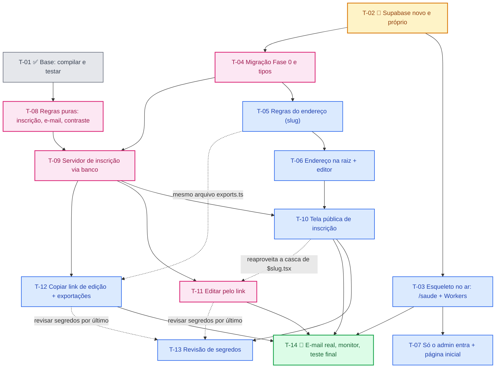

# Ordem de execução — Spec 001 (Fase 0 no ar)

> **Guia de leitura para seguir as tasks na ordem certa.** A fonte da verdade é o [`tasks.md`](./tasks.md) (cada task tem "Depende de", arquivos e verificação). Se este guia divergir do `tasks.md`, **vale o `tasks.md`** e este arquivo deve ser corrigido.

## 0. Regras de ouro

1. **Uma task por vez.** Só avance depois de rodar a verificação da task e ela passar.
2. **Portão padrão de toda task de código:** `bunx tsc --noEmit` + `bun run test` + `bun run build`. Por isso a **T-01 é pré-requisito implícito de todas as outras tasks de código** (antes dela o `tsc` falhava).
3. **Revisão obrigatória (Writer/Reviewer)** antes de seguir: **T-04, T-08, T-09 e T-11** (as de maior risco; ver `qa-plan.md`).
4. **Passos manuais 🧑:** T-02 (Supabase), partes da T-03 (Cloudflare e DNS) e T-14 (e-mail real e teste final).
5. **Branches:** enquanto não houver versão em produção, `main` e `spec-001-fase-0-no-ar` podem ser mantidas sincronizadas (fast-forward, sem `--force`). Depois do primeiro formulário real (T-14), trabalhar em branch e só então mesclar na `main`.
6. **Pontos de parada:** se a T-03 mostrar erro 1102 (limite de CPU do plano gratuito), ou se a verificação da T-04 falhar (47 PASSOU e concorrência 5 ok + 15 full), **pare** e resolva antes de seguir.

## 1. Grafo de dependências

Linhas contínuas = "Depende de" do `tasks.md`. Linhas pontilhadas = dependências **práticas** (mesmo arquivo ou reaproveitamento), que não estão no `tasks.md` mas afetam a ordem.

## 2. Ordem linear recomendada

Princípios: **risco primeiro** (infraestrutura antes do negócio), **respeitar as dependências** e **fazer deploy cedo** para validar visualmente. 🚀 = bom momento para publicar e conferir no celular.

| Passo | Task | Tipo | O que entrega | Depende de | Revisão | Deploy |
|:---:|:---:|:---:|---|---|:---:|:---:|
| 1 | **T-01** | ✅ concluída | Projeto compila; base de testes (Vitest) | — | — | — |
| 2 | **T-02** | 🧑 manual | Supabase próprio, usuário admin, cadastro desligado, `.env` público | — | — | — |
| 3 | **T-08** | código | Regras puras: CPF, e-mail, HTML seguro, contraste | T-01 | ✔ | — |
| 4 | **T-03** | código + 🧑 | `/saude` + Workers + subdomínio (mede o limite de CPU) | T-02 | — | 🚀 primeiro deploy |
| 5 | **T-07** | código | Tela de entrada só com e-mail e senha; raiz redireciona | T-03 | — | 🚀 |
| 6 | **T-04** | código | Migração Fase 0 (CPF único, vagas, edição) e `types.ts` | T-02 | ✔ | — |
| 7 | **T-05** | código | Regras do endereço (slug) | T-04 | — | — |
| 8 | **T-06** | código | Formulário em `/{endereço}` + campo de endereço no editor | T-05 | — | 🚀 |
| 9 | **T-09** | código | Inscrição via banco, e-mail, consentimento, anti-robô | T-04, T-08 | ✔ | — |
| 10 | **T-10** | código | Tela pública: consentimento, sucesso com link, mensagens | T-06, T-09 | — | 🚀 |
| 11 | **T-11** | código | Editar inscrição em `/editar/{token}` | T-09 (+ T-10) | ✔ | 🚀 |
| 12 | **T-12** | código | Copiar link de edição; exportações leves | T-09 (+ T-05) | — | 🚀 |
| 13 | **T-13** | código | Varredura de segredos no repositório | T-10 (+ T-11, T-12) | — | — |
| 14 | **T-14** | 🧑 manual | Resend real, monitor `/saude`, 5 cenários gravados | T-10, T-11, T-12, T-03 | — | 🚀 final |

**Por que esta ordem (o que mudou em relação à primeira versão deste guia):**
- **T-03 sobe para o passo 4.** Ela só depende da T-02 e é a task que mais pode falhar (limite de CPU, variáveis, domínio). Descobrir isso cedo evita construir tudo em cima de uma hospedagem que não aguenta. Também é ela que dá o endereço para validar visualmente cada passo seguinte.
- **T-07 vem logo depois da T-03.** É pequena e remove "Criar conta" e o botão do Google antes de divulgar o endereço.
- **T-06 antes da T-09.** As duas são independentes; a T-06 dá retorno visual imediato (o formulário abrindo em `/{endereço}`).
- **T-12 depois da T-05** (as duas editam `exports.ts`) e **T-11 depois da T-10** (a página de edição reaproveita a casca visual do formulário público).
- **T-13 por último antes da T-14:** a varredura de segredos só faz sentido depois que todo o código entrou.

## 3. O que pode andar em paralelo

Só faz sentido com mais de uma sessão/pessoa. Se você seguir sozinho, ignore e siga a tabela.

- **T-02 (você, manual) ‖ T-08 (agente):** a T-08 só precisa da T-01. É o paralelo mais útil agora.
- **T-06 ‖ T-09:** independentes entre si (uma é tela, a outra é servidor). Só a T-10 precisa das duas.
- **T-10 ‖ T-12:** não tocam nos mesmos arquivos.
- **Não paralelizar:** T-10 com T-11 (casca compartilhada) nem T-05 com T-12 (`exports.ts`).

## 4. Cada task em uma linha e a prova principal

| Task | Prova principal (detalhes no `tasks.md`) |
|---|---|
| T-01 | `tsc` sem erros, testes verdes, build ok |
| T-02 | `curl` de cadastro recusado (código 4xx); `.env` só com chaves públicas do projeto novo; política de senha (mín. 12) ativa |
| T-03 | `/saude` responde `{"ok":true,"db":true}` no subdomínio; sem erro 1102 no log da Cloudflare |
| T-04 | `verificacao-banco.sql`: 47 PASSOU; concorrência 5 vagas × 20 envios = 5 ok + 15 full |
| T-05 | Testes do slug passam, incluindo a comparação da lista de reservados com a migração |
| T-06 | `/qualquer-endereco` responde 200 e `/f/qualquer` responde 404; editor recusa endereço repetido/reservado |
| T-07 | `/auth` sem "Google" nem "Criar conta"; `/` redireciona |
| T-08 | Testes puros: CPF, `hideDocument`, `escapeHtml`, e-mail sem CPF completo, `isSafeRecipient`, contraste ≥ 4,5 em 216 cores |
| T-09 | Suíte verde; inscrição grava `identifier`, `edit_token`, `consented_at`; limite de 200 chaves; log sem dados pessoais; `emailSent` **obrigatório** no tipo |
| T-10 | Roteiro manual: inscrever, CPF repetido, termo sem marcar, mensagem personalizada, botão legível |
| T-11 | Roteiro 5 km → 10 km; janela de 10 min entre e-mails; `no-referrer` e `noindex` na página de edição |
| T-12 | Worker abaixo de 3 MB; exportar Excel e PDF; botão "Copiar link de edição" |
| T-13 | Varredura de segredos sem resultado; `.dev.vars` no `.gitignore` |
| T-14 | 5 cenários-chave gravados; `/saude` ok em produção; e-mail real recebido |

## 5. Pendências herdadas de tasks já concluídas

- **T-01:** o tipo `SubmitResult` ficou com `emailSent?` **opcional**; o plano exige `emailSent: boolean` obrigatório (corrigir na **T-09**).
- **Configuração local do Bun (`bunfig.toml`):** `backend = "copyfile"` e `linker = "hoisted"` foram adicionados como contorno para o Windows/OneDrive. Depois de mover o projeto para fora do OneDrive, testar sem essas duas linhas e remover se não fizerem falta (a guarda `minimumReleaseAge` deve permanecer).
